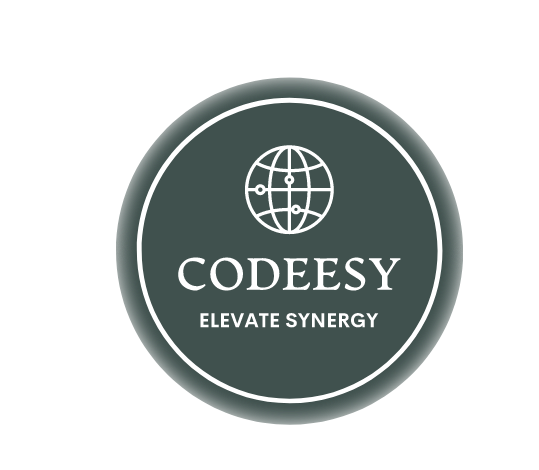

  
   

  <h1>Microverse Article</h1>
  <h3>A simple article website that provides an introduction to Microverse.</h3>

## Introduction

Microverse Article is a simple website that provides an introduction to Microverse, an online school for remote software developers. The website is designed to be easy to use and navigate, with a clean and modern design that follows Microverse's branding guidelines.

## About the Project

This project is my first capstone project with Microverse. I chose to create a summary of Microverse that would be useful for anyone who is interested in learning more about the school. The website is designed to be informative and engaging, with clear and concise content that is easy to read.

### Built With

Microverse Article website was built with:

- Major languages: JavaScript and CSS
- Technologies used: Git, GitHub, VS Code

### Live Demo

You can view a live demo of the website at [Live Demo Link](http://codeesy-ebrahim.me/capstone-project/).

## Getting Started

To get a local copy up and running, follow these steps:

### Prerequisites

To run this project, you'll need to install:

- VS Code
- Live Server extension
- Node.js

### Installation

1. Clone this repository to your desired folder:

`git clone git@github.com:Cluab/portal-capstone1.git`

### Usage

To run the project, follow these steps:

1. Open the project in VS Code.
2. Click on "Go Live" on the bottom right section of VS Code.
3. The website will open in your default web browser.

## Authors

👤 **Ibrahim Suhail Al-Yousefi**

- GitHub: [@cluab](https://github.com/Cluab)
- Twitter: [@cluab122](https://twitter.com/cluab122)
- LinkedIn: [Ebrahim Al-Yousefi](https://www.linkedin.com/in/ebrahim-alyousefi/)
- Instagram: [@27.i.b](https://www.instagram.com/27.i.b/)

## Contributing

Contributions, issues, and feature requests are welcome! Feel free to check the [issues page](https://github.com/Cluab/portal-capstone1/issues) for any open issues.

## Show Your Support

If you like this project, please give it a star on GitHub!

## Acknowledgements

- [Microverse](https://www.microverse.org/) for providing the education that inspired this project.
- Original design idea by [Cindy Shin in Behance.](https://www.behance.net/adagio07)

## License

This project is licensed under the MIT License - see the [LICENSE](./LICENSE.md) file for details.
